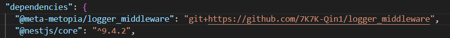

# 模块打包
## Auth: QIN, Tianxiang
如果你想将你的代码打包成一个 git 模块并在其他项目中使用，可以按照以下步骤进行操作：
### 1. 创建一个新的 git 项目
   - 打开终端并进入项目根目录。
   - 运行 `git init` 命令创建一个新的Git仓库。

### 2. 创建一个public的 git仓库
    - 在 github 上创建一个新的 public 仓库。
    - 将本地仓库与远程仓库关联：
    `git remote add origin https://github.com/Your_User_Name/Your_Repository_Name`

### 3. 创建并编辑 `package.json` 文件
- 在项目根目录下运行 `npm init` 或 `yarn init` 命令，根据提示填写项目信息，并确认生成的 `package.json` 文件。
- 在 `package.json` 文件中添加 `name`、`main`、 `version`、`description` 等字段。
- 在 `package.json` 文件中添加 `script` 的字段。
- 在 `package.json` 文件中 `dependencies` 、`devDependencies` 等字段，方便安装依赖，推荐使用pnpm来安装。
- 在 `package.json` 文件中添加 `keywords`、`author`、`license` 等字段。
- 运行 `npm install source-map-support`

### 4. 编写日志模块代码
- 在项目根目录下创建 `src` 文件夹。
   - 在 `src` 文件夹中创建你的日志模块代码文件，例如 `index.ts`、`cache.service.ts` 和 `logger.middleware.ts`。
   - 在入口文件 `index.ts` 中，使用以下代码导出你的类：
     ```typescript
     export * from './Sample1.service';
     export * from './logger.middleware';
     ```

- 如果你选择使用 TypeScript 的编译器进行构建，请确保已经全局安装了 TypeScript（`npm install -g typescript`）或将其作为项目依赖（`npm install --save-dev typescript`）。
- 创建 `tsconfig.json` 文件，运行 `tsc -init` 你也可以直接把你的写代码的那个tsconfig.json复制过来

- 在package.json文件中找到 `scripts` 在里面添加一个"build": "tsc"
   - 运行 `npm run build` 或 `yarn build` 命令来执行构建操作。
   - 如果你使用 TypeScript 的编译器，它将根据 `tsconfig.json` 的配置将 TypeScript 代码编译成 JavaScript 代码，并将输出文件保存在 `dist` 文件夹中。
- 设置好.gitignore

### 5. 上传
### 5.1 git上传
- 运行 `git add .` 命令将所有文件添加到暂存区。
- 运行 `git commit -m "Initial commit"` 命令将所有文件提交到本地仓库。
- 运行 `git push -u origin <分支名>` 命令将所有文件推送到远程仓库。
- 使用实例：

### 5.2 npm上传
- 运行 `npm login` 命令登录 npm 账号。
- 运行 `npm publish` 命令将所有文件推送到 npm 仓库。
- 使用实例：
运行 *`pnpm i <包名字>`*即可安装